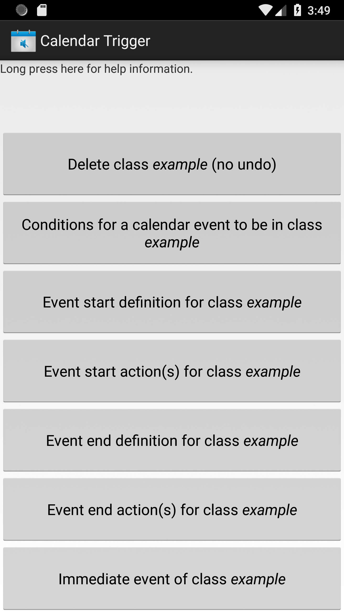
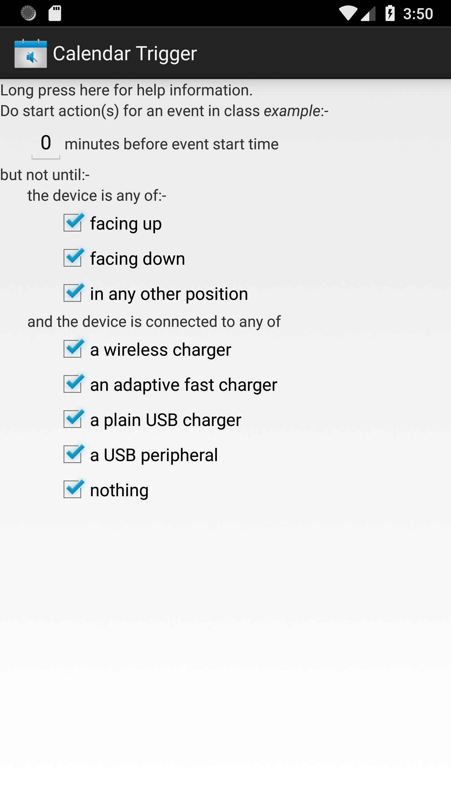
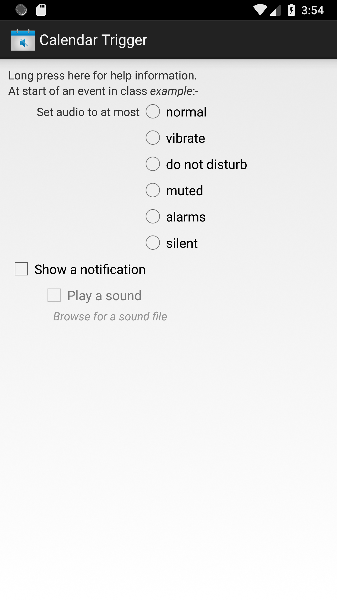

# CalendarTrigger

Trigger actions on your Android device based on calendar events

This program is a generalisation of RemiNV/CalendarMute.

It is open source, free, and does not display adverts or pester you for a donation. This will never change as long as I am maintaining it. If you want to report a problem, please enable logging and provide a log file and a settings file.

This is the screen displayed when you start up the UI

This is the screen displayed when you select Debugging from the menu

CalendarTrigger supports classes of events. Events can be classified by the calendar which they are in, the presence of a specified string in the event name or the event location or the event description, whether the event is busy, whether the event is recurrent, whether the user is the event's organiser, whether the event is public or private, whether the event has attendees, or any combination of these conditions.

This is the screen displayed when you select NEW EVENT CLASS

This is the screen displayed after creating a new class or if you select a class to be edited from the menu

This is the screen to define the conditions for an event to be in a class

At a fixed interval (possibly zero) before the start of an event, CalendarTrigger can set the ringer to mute or vibrate or set Do Not Disturb mode on Android versions which support it, or show a notification and optionally play a sound, or any combination of these actions. If the event start action does not change the ringer state or play a sound, no notification will be shown. I may add other actions in the future. Event start actions can be delayed until the device is in a particular orientation or being charged by a particular type of charger or not being charged at all. This can be useful to set a sleep mode at night. If the event start action mutes the audio, any sound played will of course not be audible. An event can be in more than one class, so it is possible to play an audio reminder a few minutes before the start of an event and then mute the audio.

This is the screen to define when CalendarTrigger does event start actions

This is the screen to define what event start actions CalendarTrigger does

At a fixed interval (possibly zero) after the end of an event, CalendarTrigger can restore the original ringer state, or show a notification and optionally play a sound. If the event end action does not change the ringer state or play a sound, no notification will be shown. Again I may add other actions in the future. Event end actions can be delayed until the device has moved by a certain distance (if it has a location sensor) or until the person holding the device has taken a certain number of steps (if it has a step counter) or until the device is in a particular orientation. This can be useful if you don't know exactly when an event will end, and you want to unmute the ringer when you leave the room or leave the building or pick the device up.

The duration of an event should be greater than zero: if it is zero, Android may awaken CalendarTrigger a short time before or after the start and end time of the event, and CalendarTrigger cannot tell whether the event has been dealt with or not.

This is the screen to define when CalendarTrigger does event end actions: the step counter option is disabled because the emulator on which these screen shots were generated doesn't emulate a step counter

This is the screen to define what event end actions CalendarTrigger does

If events which set ringer modes overlap, the "quietest" one wins. If an event end action would restore the previous ringer state, and the user has in the meantime set a "quieter" state, the user's set state wins. The quietness order is as in the selection list for event start actions.

CalendarTrigger also has immediate events, useful if you walk into a "quiet" building and want to mute your ringer until you leave.

CalendarTrigger scans all of your calendars once for each event class every time anything happens which might cause it to take some action. This will not interfere with other applications because it happens in the background, but it does need the phone to wake up and use battery power, so you should not define too many event classes. Some Calendar Providers seem to generate many PROVIDER_CHANGED broadcasts even when nothing has actually changed, but CalendarTrigger needs to wake up for these broadcasts to determine whether in fact anything _has_ changed, so I can't do anything about this. You could try complaining to your phone manufacturer....

The UI is available in English and French: the French version could probably be improved as I am not a native speaker.

Help with the French translations would be welcome, as would UI translations for other languages.

## Help information
CalendarTrigger uses the convention that a long press on a user interface object (such as a button or a checkbox) will pop up some information (usually in a toast) explaining what it does. If an option is disabled because CalendarTrigger does not have the permissions it needs to do that function, a long press will explain which permission is needed to enable it. If an option is disabled because your device's operating system or hardware does not support it, a long press will dispaly a message saying so.

This is a Screen showing a help information popup

Some more complicated behaviours are described in this README file.

## Next Location feature

Some satnav systems can connect via Bluetooth to your phone, read your contact list, and navigate to the address of a selected contact. Unfortunately satnav
systems are a bit picky about address formats, and some can't decode the
unstructured string address of the contact. If you have a contacts manager which allows you to put in the address with separate fields for street address,
city, postcode, and country, you will get better results.

It would be nice if the satnav could navigate to the address of the next appointment in your calendar too, but there isn't a Bluetooth protocol for it to read your calendar. The next location feature in CalendarTrigger, which can be enabled from the debugging screen, attempts to work around this. It creates a virtual contact called !NextEventLocation (the ! makes it appear at the top of the list) and arranges for its address to always be the location of the next event in your calendar which has a location. The Location field in a calendar event is an unstructured string: CalendarTrigger does its best to decode this into its component parts.

What it likes is a comma-separated list starting with a street name with a house number, followed by a town name with a postcode, followed by a country name. It will ignore a building name or a company name (but not both) provided that it can identify a street name after it. A street name without a house number (unfortunately quite common usage in the UK) is accepted if it can identify a town name with a postcode after it. If the street name has a house number, a neighbourhood name can appear between the street name and the town name. A US state name or a UK county name or their standard abbreviations can appear before the country name. The common UK usage of putting a comma between the house number and the street name is also accepted, as is the common US usage putting the zip code after the state instead of after the town name. A comma can be present between the town name and the postcode. The continental European format of a country abbreviation hyphenated before the postcode is also accepted as long as your satnav can recognise the country abbreviation.

If it finds a country name, anything after a comma following it is ignored: you can put class flags there. If you leave out the country name, and it can't guess USA or UK from the presence of a state or county name, it will assume the country in which the phone currently is, as determined by the Mobile Country Code of the cellular network to which it is currently connected, if any.

Anything else in the address can be hidden from its decoder by enclosing it in () or [] or {} or <>. In particular apartment or flat numbers *must* be hidden in this way, since it can't distinguish those from the usage in some continental European countries of putting the house number after the street name. You don't have to hide the commas: it will disregard a comma after a field containing only hidden text.

So all of the following should work:-  

_6 parvis Notre-Dame - Place John Paul II, F-75004 Paris_  

_Westminster Abbey, 20, Dean's Yard, City of Westminster, London, SW1P 3PA, England_  

_Groenplaats 21, 2000 Antwerpen, Belgium_..

_Onze-Lieve-Vrouwekathedraal, Groenplaats 21, B-2000 Antwerpen_..

_The White House, 1600 Pennsylvania Avenue NW, Washington, DC 20500, USA_  

_1600 Pennsylvania Avenue NW, Washington 20500, District of Columbia_  

_(Apartment 5A), 129 West 81st Street, New York, NY 10024_..

_Shakespeare’s Globe, 21 New Globe Walk, London SE1 9DT, England {mute inside}_  

where presumably you have an event class which includes events whose location contains {mute inside}.

If the location of the event, instead of being an address, is of the form

_@label firstname lastname_

where _label_ is empty or _HOME_ or _WORK_ or _OTHER_ or a string matching the _LABEL_ of a _CUSTOM_ type address, CalendarTrigger uses the first address of the corresponding type (or any type if _label_ is empty) that it finds in any contact matching _firstname_ and _lastname_. This enables you to specify an event at a contact's address without having to retype the address. It doesn't parse the address, so the contact's address in the phone needs to be understandable to your satnav. Note that this is an event location format specific to CalendarTrigger: other calendar tools are unlikely to understand it.

## Signing and saving settings
Newer versions of Android do not allow you to install unsigned applications. The `.apk` file in the git release is signed (with my signing key) as is the `.apk` file dowloadable from [fdroid](https://f-droid.org) (with their signing key). Naturally neither I nor fdroid are willing to publish our signing keys, so if you build your own version you will need to to sign it with your own signing key. The `app/build.gradle` file expects a `keystore.properties` file in the project root directory, which you will need to fill with the details of your own signing key. You can find how to create it [here](https://developer.android.com/studio/publish/app-signing.html).

Having multiple signing keys causes problems if you have previously installed one version and want to install a newer version of the same application signed with a different key: Android does not allow this, and you have to uninstall the old application before installing the new one This deletes the application's data, which means for CalendarTrigger that you lose all its settings including all of your class definitions.

If Android will still not install a new version even after uninstalling the old one, this may be because the old `.apk` file is still present, which confuses the installer. Finding the old `.apk` file and deleting it should help.

In order keep the its data, CalendarTrigger now allows you to save its settings to a (fixed) file or to replace the current settings by those from the file: there are buttons to do these actions in the Debugging screen. This can be used to save the settings before uninstalling, or to transfer your settings to a different device.

## Permissions
CalendarTrigger uses the following permissions:-

READ_CALENDAR
This is needed for CalendarTrigger to work at all: if this permission is denied, the User Interface will appear to work, but attempts to read the calendar will return nothing, so it will not do anything in response to calendar events.

READ_PHONE_STATE
This is needed to enable CalendarTrigger to avoid muting the audio during a call: if this permission is denied and an event calls for the audio to be muted, it may mute the audio even if a call is in progress. If it notices that this permission was previously granted but has been removed, it will display a notification (only once each time the permission state changes).

REQUEST_IGNORE_BATTERY_OPTIMIZATIONS
This is needed to prevent Android from shutting down CalendarTrigger's background server. In some versions of Android, you need to explicitly whitelist CalendarTrigger somewhere in the settings page (unfortunately different versions do this in different places) in order to protect it from battery optimisation: other versions will ask you before applying battery optimisation to an application or permitting an application to have this permission. If this permission is denied and CalendarTrigger's background server is shut down unexpectedly, it may fail to respond correctly to the start or the end of an event.

WAKE_LOCK
This is needed to enable CalendarTrigger to stay awake while waiting for certain sensors to initialise: currently this permission is always granted. If some future Android version allows it to be denied, CalendarTrigger may crash or otherwise not work properly.

MODIFY_AUDIO_SETTINGS
This is needed to enable CalendarTrigger to mute the ringer: currently this permission is always granted. If some future Android version allows it to be denied, CalendarTrigger may crash or otherwise not work properly.

ACCESS_NOTIFICATION_POLICY
This is needed to enable CalendarTrigger to set and clear Do Not Disturb mode on those versions of Android which support it: if this permission is denied, it will revert to the behaviour on earlier versions of Android which only allow it to set the ringer to vibrate or silent, and the Do Not Disturb options on the Event Start Action screen will be disabled.

READ_CONTACTS
WRITE_CONTACTS
These are needed to make the Next Location feature work. CalendarTrigger only reads and write its own !NextEventLocation contact and does not read or write any other contacts (it is open source so you can check this). If this permission is denied, the Next Location feature is not available and the checkbox for it is disabled on the debugging screen: CalendarTrigger will otherwise work normally.

WRITE_EXTERNAL_STORAGE
This is needed to enable CalendarTrigger to write a log file or a settings file. If you never enable logging or save settings, it isn't needed; if this permission is denied, logging cannot be enabled and settings cannot be saved. If you enable logging, you need to clear the log file from time to time, otherwise it will fill up memory.

ACCESS_FINE_LOCATION
This is needed to enable CalendarTrigger to detect when the device has moved by a sufficient distance after the end of an event: if this permission is denied, the option is disabled, but CalendarTrigger will otherwise work normally.

#### What can I legally do with this app ?
This application is released under the GNU GPL v3 or later, do make sure you abide by the license terms when using it.
Read the license terms for more details, but to make it very (too) simple: you can do everything you want with the application, as long as you provide your source code with any version you release, and release it under the same license.
