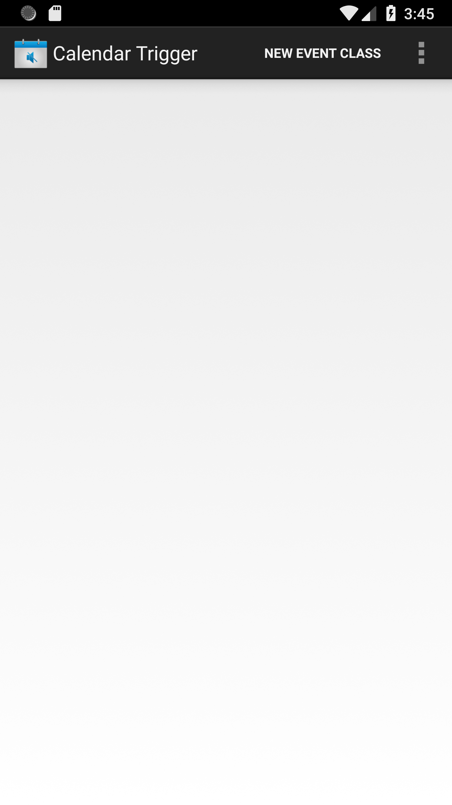
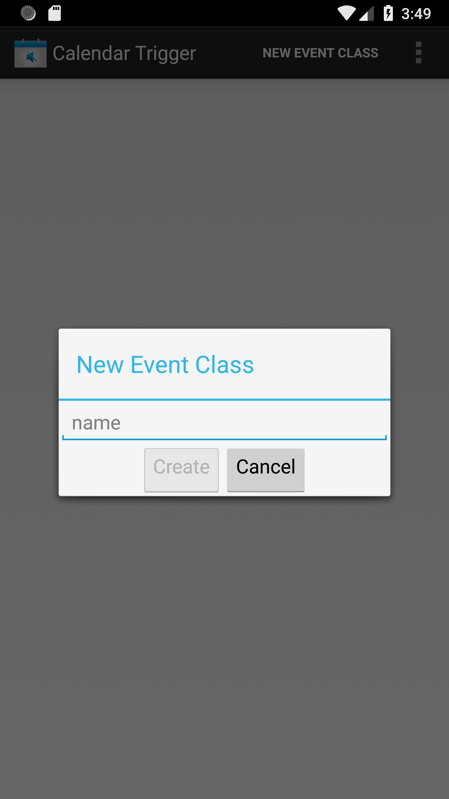
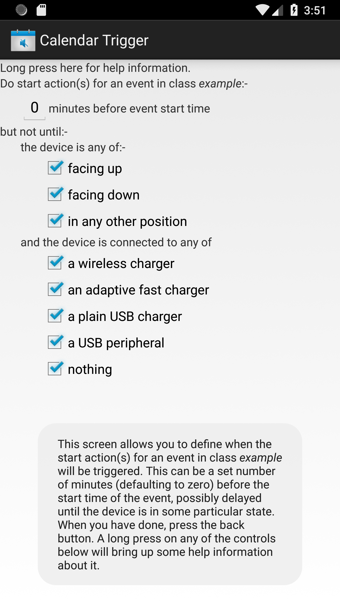
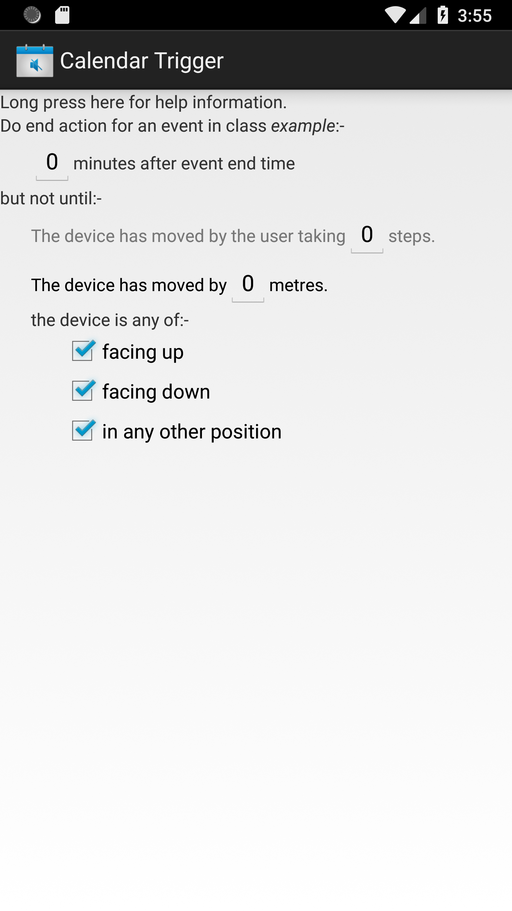
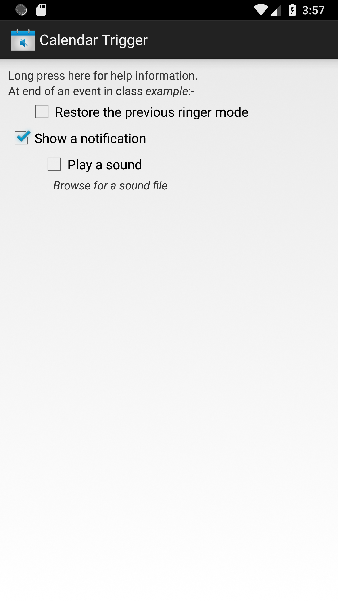

Note: this README is for a new version, source code not posted yet

##CalendarTrigger

Trigger actions on your Android device based on calendar events

This program is a generalisation of RemiNV/CalendarMute.

It is open source, free, and does not display adverts or pester you for a donation. This will never change as long as I am maintaining it. If you want to report a problem, please enable logging and provide a log file.

CalendarTrigger supports classes of events. Events can be classified by the calendar which they are in, the presence of a specified string in the event name or the event location or the event description, whether the event is busy, whether the event is recurrent, whether the user is the event's organiser, whether the event is public or private, whether the event has attendees, or any combination of these conditions.

At a fixed interval (possibly zero) before the start of an event, CalendarTrigger can set the ringer to mute or vibrate or set Do Not Disturb mode on Android versions which support it, or show a notification and optionally play a sound, or any combination of these actions. If the event start action does not change the ringer state or play a sound, no notification will be shown. I may add other actions in the future. Event start actions can be delayed until the device is in a particular orientation or being charged by a particular type of charger or not being charged at all. This can be useful to set a sleep mode at night. If the event start action mutes the audio, any sound played will of course not be audible. An event can be in more than one class, so it is possible to play an audio reminder a few minutes before the start of an event and then mute the audio.

At a fixed interval (possibly zero) after the end of an event, CalendarTrigger can restore the original ringer state, or show a notification and optionally play a sound. If the event end action does not change the ringer state or play a sound, no notification will be shown. Again I may add other actions in the future. Event end actions can be delayed until the device has moved by a certain distance (if it has a location sensor) or until the person holding the device has taken a certain number of steps (if it has a step counter) or until the device is in a particular orientation. This can be useful if you don't know exactly when an event will end, and you want to unmute the ringer when you leave the room or leave the building or pick the device up.

If events which set ringer modes overlap, the "quietest" one wins. If an event end action would restore the previous ringer state, and the user has in the menatime set a "quieter" state, the user's set state wins. The quietness order is as in the selection list for event start actions.

CalendarTrigger also has immediate events, useful if you walk into a "quiet" building and want to mute your ringer until you leave.

CalendarTrigger scans all of your calendars once for each event class every time anything happens which might cause it to take some action. This will not interfere with other applications because it happens in the background, but it does need the phone to wake up and use battery power, so you should not define too many event classes. Some Calendar Providers seem to generate many PROVIDER_CHANGED broadcasts even when nothing has actually changed, but CalendarTrigger needs to wake up for these broadcasts to determine whether in fact anything has changed, so I can't do anything about this. You could try complaining to your phone manufacturer....

The UI is available in English and French: the French version could probably be improved as I am not a native speaker.

Help with the French translations would be welcome, as would UI translations for other languages.

## Help information
CalendarTrigger uses the convention that a long press on a user interface object (such as a button or a checkbox) will pop up some information (usually in a toast) explaining what it does. If an option is disabled because CalendarTrigger does not have the permissions it needs to do that function, a long press will explain which permission is needed to enable it. If an option is disabled because your device's operating system does not support it, a long press will say so.

Some more complicated behaviours are described in this README file.

## Next Location feature

Some satnav systems can connect via Bluetooth to your phone, read your contact list, and navigate to the address of a selected contact. Unfortunately satnav
systems are a bit picky about address formats, and some can't decode the
unstructured string address of the contact. If you have a contacts manager which allows you to put in the address in separate fields for street address,
city, postcode, and country, you will get better results.

It would be nice if the satnav could navigate to the address of the next appointment in your calendar too, but there isn't a Bluetooth protocol for it to read your calendar. The next location feature in CalendarTrigger, which can be enabled from the debugging screen, attempts to work around this. It creates a virtual contact called $Next $Location (the $ signs make it appear at the top of the list) and arranges for its address to always be the location of the next event in your calendar which has a location. The Location field in a calendar event is an unstructured string; CalendarTrigger does its best to decode this into its component parts. You can help it by using standard format addresses:

20 Dean's Yard, London SW1P 3PA, England

should work. For public buildings which your satnav knows about,

Westminster Abbey, London SW1P 3PA, England
Westminster Abbey, 20 Dean's Yard, London SW1P 3PA, England

should also work. If you're in Europe,

6 parvis Notre-Dame - Place John Paul II, F-75004 Paris

should work. In the USA

1600 Pennsylvania Avenue NW, Washington, DC 20500, USA

should work as well. It knows that DC is in the USA, so you can leave out the USA for American addresses: the format

1600 Pennsylvania Avenue NW, Washington 20500, District of Columbia

is also accepted.

If you leave out the country name, CalendarTrigger will assume that it is the country in which the phone currently is, as determined by the Mobile Country code of the cellular network to which it is currently connected, if any.

Flat or apartment numbers or rooms within a building will probably confuse it, because it can't tell "Apartment 17" from a street address in those countries where it's normal to put the house number after the street name.

Calendar Trigger will ignore anything after the state or country name if there is at least one punctuation character (other than - or ,) in between, so something like

1600 Pennsylvania Avenue NW, Washington 20500, DC (West Wing)

will work: this is the best way of attaching sub-building information or company names to an address. Tags used to identify event classes can also be hidden from the address decoder in this way, for example

Shakespeare’s Globe, 21 New Globe Walk, London SE1 9DT, England {mute inside}

where presumably you have an event class which includes events whose location contains {mute inside}.

## Permissions
CalendarTrigger uses the following permissions:-

READ_CALENDAR
This is needed for CalendarTrigger to work at all: if this permission is denied, the User Interface will appear to work, but attempts to read the calendar will return nothing, so it will not do anything in response to calendar events.

READ_PHONE_STATE
This is needed to enable CalendarTrigger to avoid muting the audio during a call: if this permission is denied and an event calls for the audio to be muted, it may mute the audio even if a call is in progress. If it notices that this permission was previously granted but has been removed, it will display a notification (only once each time the permission state changes).

REQUEST_IGNORE_BATTERY_OPTIMIZATIONS
This is needed to prevent Android from shutting down CalendarTrigger's background server. In some versions of Android, you need to explicitly whitelist CalendarTrigger somewhere in the settings page (unfortunately different versions do this in different places) in order to protect it from battery optimisation: other versions will ask you before applying battery optimisation to an application. If CalendarTrigger's background server is shut down unexpectedly, it may fail to respond correctly to the start or the end of an event.

WAKE_LOCK
This is needed to enable CalendarTrigger to stay awake while waiting for certain sensors to initialise: currently this permission is always granted. If some future Android version allows it to be denied, it may crash or otherwise not work properly.

MODIFY_AUDIO_SETTINGS
This is needed to enable CalendarTrigger to mute the ringer: currently this permission is always granted. If some future Android version allows it to be denied, it may crash or otherwise not work properly.

ACCESS_NOTIFICATION_POLICY
This is needed to enable CalendarTrigger set and clear Do Not Disturb mode on those versions of Android which support it: if this permission is denied, it will revert to the behaviour on earlier versions of Android which only allow it to set the ringer to vibrate or silent, and the Do Not Disturb options on the Event Start Action screen will be disabled.

READ_CONTACTS
WRITE_CONTACTS
These are needed to make the Next Location feature work. CalendarTrigger only reads and write its own $Next $Location contact and does not read or write any other contacts (it is open source so you can check this). If this permission is denied, the Next Location feature is not available and the checkbox for it is disabled on the debugging screen: it will otherwise work normally.

WRITE_EXTERNAL_STORAGE
This is needed to enable CalendarTrigger to write a log file. If you never enable logging, it isn't needed; if this permission is denied, logging cannot be enabled.

ACCESS_FINE_LOCATION
This is needed to enable CalendarTrigger to detect when the device has moved by a sufficient distance after the end of an event: if this permission is denied, the option is disabled, but CalendarTrigger will otherwise work normally.

#### What can I legally do with this app ?
This application is released under the GNU GPL v3 or later, do make sure you abide by the license terms when using it.
Read the license terms for more details, but to make it very (too) simple: you can do everything you want with the application, as long as you provide your source code with any version you release, and release it under the same license.
